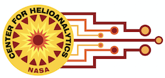

#  EPSCOR Hack Week Python Tutorials 

Brought to you by: 

    

This series of tutorials is part of the 2022 EPSCOR Hack Week (<a href="https://www.nasawvepscor.org/hack-week/">https://www.nasawvepscor.org/hack-week/</a>) held June 12-17, 2022 on the West Virginia University campus in Morgantown, WV.

These tutorials are made possible through the support of the NASA GSFC Advanced Software Technology Group.  
See their extensive python course materials here:    https://github.com/astg606/py_courses/tree/master/modules

To start, you can take the <a href="https://forms.gle/PTV6xFCA21NYkqfp9">Python Assessment Test</a>

A score of 80% or higher means you may want to skip the "beginner" course material.

### EPSCOR Hack Week Python Tutorial Schedule

| Session | Lecture Topic | Link | Instructor |
|------|---------------|------------------|----------|-----------|
| Session 1A | **Why Learn Python?** | [Intro Presentation](https://docs.google.com/presentation/d/1A7Gesz8DzXBZ-tRLvcRfsX09E0PTj1RRyCEWcmuc1d0/edit#slide=id.gb98c9bbaa9_0_8) |  |
| Session 1B | **Intro to Python Notebooks and Code Sharing**  |  | Thompson |
| Session 1C | **Basic Data Principles**  |  | | |
| Session 1D | **Control Flow and Loops**  |  |  ||
| Session 2A | **Functions** |  |  ||
| Session 2B | **Basic python modules, packages and libraries** |  |  ||
| Session 2C | **File Input/Output**  |  |  ||
| Session 2D | **Making plots and displaying data**  |  |  ||
||||||
| | Glossary of python terms | [Link](https://github.com/HelioAnalytics/EPSCOR_Hackweek/blob/master/Course%20Materials/Python_glossary.ipynb)|||

## Other Python Course Materials

- Goddard ASTG Python courses (available to Helio community):  
    - Python placement test (if you score >80% you may want to skip the beginner courses):  https://docs.google.com/forms/d/e/1FAIpQLSdXdI4yQI0voiZ8AZFYw5yyrXbiZAU87vHJm574PwP9l8IXdA/viewform
    - Beginner Python: https://github.com/astg606/py_courses/tree/master/beginner_python
    - Full Collection of Courses: https://github.com/astg606/py_courses/tree/master/modules

## General Python Resources

### Books and texts 
Two excellent beginner books (both are available online under public license but you can support the developers by purchasing the books): 
- "Problem Solving with Python" by Peter D. Kazarinoff https://problemsolvingwithpython.com/
- "The Python Data Science Handbook" by Jake VanderPlas https://jakevdp.github.io/PythonDataScienceHandbook/ 

### Online articles 
- "Towards Data Science" has many articles for beginners to advanced levels on coding and development:  https://medium.com/towards-data-science/
- "KD Nuggets" was started by a space scientist turned data scientist (Kirk Borne). A great way to keep up on what's happening in data science:  https://www.kdnuggets.com/ 

